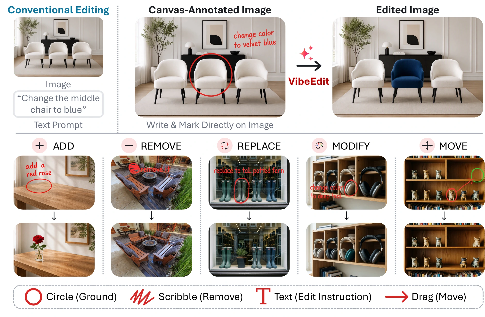

# VibeEdit: Image Editing with Canvas Instructions

[Project Page](https://zhaojingjing713.github.io/VibeEdit/) · [Paper](asserts/VibeEdit.pdf)

Jinjing Zhao1,*, Fangyun Wei2,*, Yitong Wang3, Xiuyu Wu4, Yunuo Chen5, Yang Yue6, 
Sirui Zhang7, Wenbo Wang1, Hongyang Zhang8, Dong Chen2, Yan Lu2, Chang Xu1,†

1 University of Sydney · 2 Microsoft Research · 3 Fudan University · 4 Nankai University 
5 Shanghai Jiao Tong University · 6 Tsinghua University · 7 University of Science and Technology of China · 8 University of Waterloo

* Equal contribution. † Corresponding author.

**VibeEdit** edits images using spatial marks and optional short notes drawn directly on the image. It supports object addition, removal, replacement, attribute modification and movement without a separate text prompt.

## Abstract

In text-guided image editing, describing the desired change is often straightforward, but identifying the intended object or region can be cumbersome, especially when several objects look alike. We introduce a new image editing interface that lets users place spatial marks and optional short notes directly on the image. Together, these annotations form a *canvas instruction* that specifies where to edit and what to change. Our editor, *VibeEdit*, follows these instructions to perform object addition, removal, replacement, attribute modification, and movement without a separate text prompt. We construct 1.55 million source–target edit pairs with object masks and structured edit descriptions, from which we render canvas instructions during training. We adapt Qwen-Image-Edit with layer-decoupled conditioning that separately encodes source images and canvas instructions for image editing. We train the model with region-weighted supervised fine-tuning, followed by rubric-guided reinforcement learning to improve edit completion, local edit quality, and preservation of unedited regions. We evaluate VibeEdit on an independently constructed, human-curated benchmark of 419 cases emphasizing target selection among similar objects. VibeEdit achieves a VLM rubric score of 79.9 and an outside-region PSNR of 32.8 dB, compared with 67.4 and 24.0 dB for FireRed, the highest-scoring text-instructed baseline in our evaluation.

## Code

**Coming soon.**

## Project page

The website is maintained in the [`page` branch](https://github.com/ZhaoJingjing713/VibeEdit/tree/page) and published with GitHub Pages.
